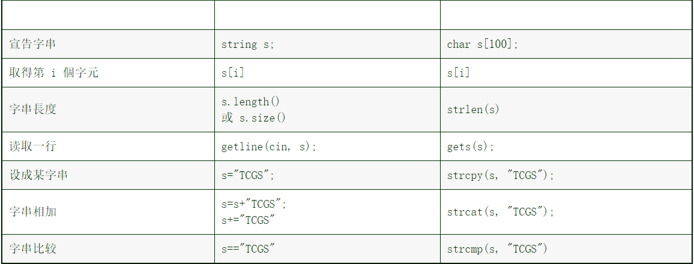

# 字符串分割函数

```cpp
/*
算法功能：按一种字符，将一个字符串分割成多个字符串，放在vector中
*/
vector<string> splitStr(const string &s, const string &seperator) 
{

	vector<string> result;
	typedef string::size_type string_size;
	string_size i = 0;

	while (i != s.size()) {
		//找到字符串中首个不等于分隔符的字母；
		int flag = 0;
		while (i != s.size() && flag == 0) {
			flag = 1;
			for (string_size x = 0; x < seperator.size(); ++x)
				if (s[i] == seperator[x]) {
					++i;
					flag = 0;
					break;
				}
		}

		//找到又一个分隔符，将两个分隔符之间的字符串取出；
		flag = 0;
		string_size j = i;
		while (j != s.size() && flag == 0) {
			for (string_size x = 0; x < seperator.size(); ++x)
				if (s[j] == seperator[x]) {
					flag = 1;
					break;
				}
			if (flag == 0)
				++j;
		}
		if (i != j) {
			result.push_back(s.substr(i, j - i));
			i = j;
		}
	}

	return result;
}
```

```cpp
//根据字符串c模式，来分割字符串s，结果放在v中
void SplitString(const string& s,const string& c,vector<string>& v){
    string::size_type pos1,pos2;
    pos1 = 0;
    pos2 = s.find(c); //找到字符串c在s中的起始位置
    while(string::npos != pos2){ //如果存在c子串
        v.push_back(s.substr(pos1,pos2-pos1)); //分割
        pos1 = pos2+c.size();
        pos2 = s.find(c,pos1); //从pos1位置开始寻找c子串
    }
    if(pos1 != s.length()){ //pos1未到s的末尾(最后一个字符后面的位置)
        v.push_back(s.substr(pos1)); //pos1处及以后形成的子串
    }
}

```

**可以用getline和stringstream分割字符串**

```cpp
stringstream ss="///5"
string s;
while(getline(ss,s,'/')){
    cout<<s<<"#";
}
//out: ###5
```

# string的比较

慎用string.compare()函数

```cpp
string s1,s2;
s1 = "1234";
s2 = "124";
if(s1 < s2)
	printf("yes");
//out:yes
```

# 查找

```cpp
string str = "163456"
int k1 = str.find('6',2); //out:5
str = "zhou zhou";
k1 = str.find("zhou",2); //out:5
```

# 插入

```cpp
string s;
s.insert(2,'a');
s.insert(2,"aa");
s.insert(s.begin()+2,"a");
```



# 删除

```cpp
str.erase(5); //删除从5开始到末尾的字符
str.erase(5,4); //删除从5开始的4个字符
str.erase(str.begin()+2); //删除从2开始到末尾的字符
str.erase(str.begin()+2,str.begin()+4); //删除从2,3处的字符
```

