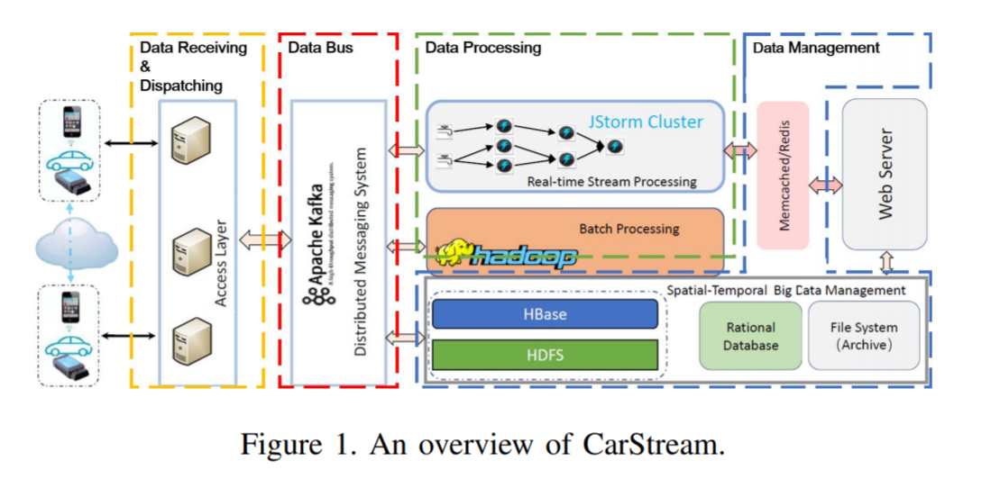
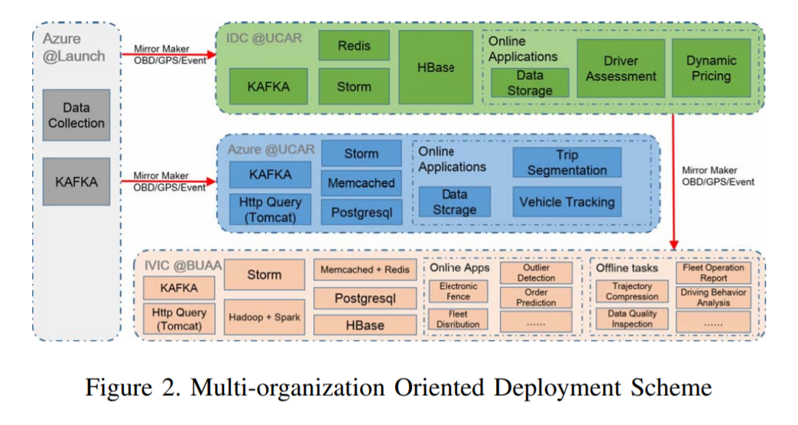
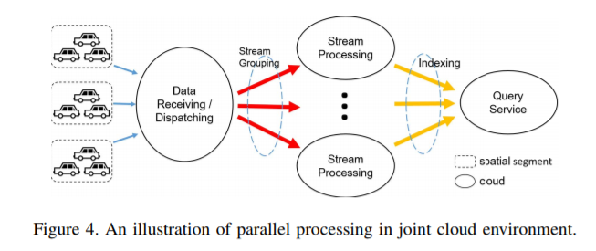

# Abstract

we provide a scalable IoV system deployment in the **joint Cloud** environment where cloud vendors collaboratively cooperate as an alliance.

In particular, system components are **independently deployed** in accordance with the data placement and resource capacities etc.

A **multi-replication mechanism** is utilized to achieve the cross-cloud parallel processing

# Introduction

IoV利用云中心去处理数据。

cloud-based IoV系统由许多组件组成。传统的解决方案是，部署在proprietary cloud上，如AWS。但是， different service components and the data store usually require to be deployed and managed on multiple Cloud platforms for the performance consideration. 

**为什么要部署在混合云上？**

organizations have their specialized requirements and priorities in terms of the provisioned quality of services (QoS)（所以对于不同的service component要部署在不同的cloud上）

 It is inconceivable for any service providers to build a monolithic system at scale to manage across-region resources including storage and computational tasks

It is far more cost-effective to properly schedule computation tasks adjoin to the data;

**要解决的挑战是什么**

The system must be deployed to ensure the existing modules to work smoothly whilst multiple constraints being satisfied.

the system should be highly scalable to timely handle the geo-distributed data at scale.

 distributed data is supposed to be flexibly managed for the effective access by data analysis applications.

# Background

## CarStream System

 to ensure the safety and quality of the trip services and support timely fleet scheduling and long-time operational management, 关于车的各项数据采集到云上进行存储和处理

## Joint Cloud Environment

by empowering the cooperation among multiple Cloud vendors to provide crossCloud services

# System Component Deployment

we display the criteria for the component placement and orchestration and how we deploy the system in practice.

There are a number of system constraints when deploying different system components with **differentiated requirements** into the joint cloud environments.

## A pratical Deployment Solution

绿色用于存储敏感数据；蓝色的用于流处理；橘色的用于存储历史数据和做数据分析

# Data Sharding

## partitioning for geo-distributed data

Vehicles data from different spacial areas can be collected and computed independently. Therefore, streaming data belonging to different partitions can be dispatched to the replica of a processing component in different Clouds.

解决了scalability的问题，因为可以把数据分到不同的地方的云上进行处理，在不同的云上独立地进行处理和维护，由query模块来查询不同云上的处理结果。

## implementation

分成三个区域，每个区域(segment)都有一个云中心来做流处理。另外有一个云中心部署了kafka软件栈，来收集数据，决定把数据分到哪个segment，根据这一个决定，把数据归到某个kafka topic中。

In particular, if we find out a vehicle is traversing spatial parts according to its uploading data, we will add this data package to both the Kafka topic of the old part and the topic of the new part（这一点我不懂了，不是可以通过query模块查询吗，为什么非得在两个云上都保存数据）

# ML application case study

  