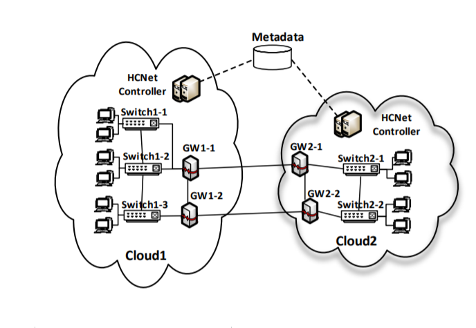

**Quick failoverHCNet: An SDN Enabled Virtual Network Management System for Hybrid Clouds**

# 基础知识

https://blog.csdn.net/liukuan73/article/details/48270011

https://blog.csdn.net/rishengcsdn/article/details/38757505?depth_1-utm_source=distribute.pc_relevant.none-task-blog-OPENSEARCH-1&utm_source=distribute.pc_relevant.none-task-blog-OPENSEARCH-1

# Abstract

without a meticulous design, the inter-cloud VNs would suffer from a performance limitation introduced by the Internet, e.g., the intercloud bandwidth provided by the Internet is much lower and more fluctuant than that of the intra-cloud networks. 

* make use of SDN
*  supports multi-tenancy and full address space virtualization on both Layer-2 and Layer-3 networks through the help of its elaborated packet processing pipeline
*  leverages a dynamic load balance policy atop multiple inter-cloud gateways to achieve better performance on inter-cloud virtual networking
* Quick failover: maintains master-slave backup relationship based on paxos protocol to deal with controller outages.

# Introduction

A well-defined VN service is able to provide arbitrary virtualized network abstractions for cloud customers.

With the support of fully virtualized L2 and L3 networks, tenants can deploy their applications with the same network configuration as in their on-premise datacenters. For these reasons, it’s important for hybrid clouds to support VN on both L2 and L3.(网络虚拟化的必要性)

问题：
L2 Scalability Issues
L3 Management Costs
VN Performance Limitation For Inter-cloud Data Transmission

 HCNet leverages Software Defined Networking (SDN) to ease the management of high-performance virtual network for hybrid clouds, and it supports flexible network management.

# System Design

In HCNet, all the distributed **controllers** constitute a logically centralized control plane while each of them is responsible for the control of its local network.

HCNet can support **arbitrary topology** by its topology discovery mechanism. Based on the network topology that it discovers, HCNet automatically calculates the **data forwarding path** between two communicating switches. It therefore supports arbitrary network topology.

Layer-2 (L2) network applies flat addressing scheme by default. This, however, prevents the network from scaling because a large number of **flow entries** are needed to proceed and forward packets between each pair of communicating VMs. In fact, with a well-defined mac address schema, the **data plane devices** are able to conduct **wildcard matching**, and therefore achieves **flow rules aggregation**.

#  PACKET PROCESSING PIPELINE