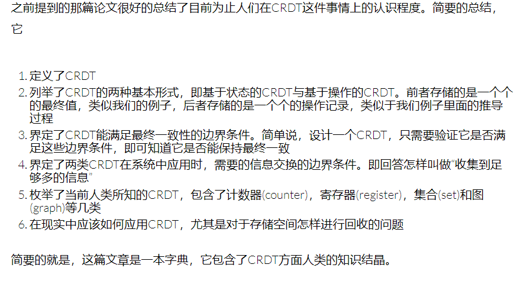

**由于完全读不懂论文，我需要学习一下CRDT是什么**

# 基础知识

研究分布式系统，尤其是研究最终一致性分布式系统的过程中，一个最基本的问题就是，应该采用什么样的数据结构来保证最终一致性？ 这是一个关键的，难度超过一般人想象的问题。
简单的讲，构建一个分布式系统跑得飞快完全不难（例如写个存什么但是不保证取出来的系统:-)），只有构建一个运作起来正确性与单机程序完全无二的分布式系统，这才困难。

CAP定理告诉我们，在构建分布式系统的时候，**Consistency（一致性）**，**Availability（可用性）**，**Partition tolerance（分区容错性）**，这三者只可以同时选择两样。

选择一致性，构建的就是强一致性系统，比如符合ACID特性的数据库系统。选择可用性，构建的就是最终一致性系统。前者的特点是数据落地即是一致的，但是可用性不能时时保证，这意思就是，有时系统在忙着保证一致性，无法对外界服务。后者的特点是时时刻刻都保证可用性，用户随时都可以访问，但是各个节点之间会存在不一致的时刻。

CRDT是能够保持最终一致性的数据结构

参考：http://liyu1981.github.io/what-is-CRDT/
https://www.jianshu.com/p/7e89239caaf2

# Abstract

​	Internet-scale distributed systems often replicate data within and across data centers.......This brings the issue of conflict resolution among concurrent updates.

CRDT是为了解决上述挑战.

​	This work focuses on a special type of CRDT, namely the Conflict-free Replicated Data Collection (CRDC), e.g. list and queue.

Complex CRDCs can greatly ease the development of upper-layer applications, but also makes the conflict resolution notoriously difficult. This explains why existing CRDC designs are tricky, and hard to be generalized to other data types.(现存的问题)

The remove-win strategy for conflict resolution is simple but powerful. The remove operation just wipes out the data item, no matter how complex the value is. The user of the CRDC only needs to specify conflict resolution for non-remove operations.(这个remove-win可以用来解决上述问题)

# Introduction

For instance, the experiments from Google demonstrate that increasing web search latency 100 to 400ms reduces the daily number of searches per user by 0.2% to 0.6% [11]. Thus, many Internet-scale distributed systems are designed for low latency and high availability in the first place.(分布式系统要low latency and high availability)

To provide low latency and high availability, the update requests must be handled immediately, without communicating with remote replicas.(但是为了快速更新，不能和远程副本交流了)

Strong Eventual Convergence (SEC) is widely accepted, which ensures that when any two replicas have received the same set of updates, they reach the same state

The design of replicated data types satisfying SEC brings the challenge of conflict resolution for concurrent updates on different replicas of logically the same data. The conflict resolution is especially hard and error-prone when the replicated data type is complex and has rich semantics.(有了问题)----->The Conflict-free Replicated Data Type (CRDT) framework provides a principled approach to address this challenge(CRDT解决问题)

The CRDC is a collection of data items, which have user-specified values and are organized in certain structure(CRDC的例子是sets, lists, queues and graphs). However, complex data collection types also make the conflict resolution for concurrent updates notoriously difficult and error-prone.(CRDC也有问题)

# remove-win design framework

What is CRDC?
The design of a CRDC mainly focuses on the design of update operations........In the prepare part, the immediate local processing on the replica, where the update operation is triggered, is specified. In the effect part, it is specified how the remote replica handles the update asynchronously propagated to it. Essentially, conflict resolution is conducted in this part to ensure that all replicas eventually converge to the same state when they receive the same set of update operations. (在effect阶段，执行conflict resolution)

