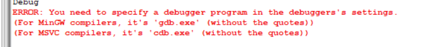

# 2019/8/5

### 青春痘大小测量

#### 要学习的东西

* 深度卷积网络
* data augumentation
* 学会用框架搭建网络

# 2019/8/6

### 青春痘大小测量

1. U-Net的数据集包括类型为np.float32的训练图片和标签，训练图片的元素的值在``[0.0, 1.0]``，标签图片中像素只有1.0和0.0两种值。

2. 训练过程有两个关键词：steps和epoch。

   拥有越高性能的GPU，则可以设置越大的batch_size值。根据现有硬件，我们设置了每批次输入50-100张图像。参数steps_per_epoch是通过把训练图像的数量除以批次大小得出的。例如，有100张图像且批次大小为50，则steps_per_epoch值为2。

3. <https://github.com/FENGShuanglang/unet>中U-Net源码

   data.py中的trainGenerator()是生成器，用于一次性生成batch_size数量的(image, label)组合，然后喂到(model.fit_generator, model是keras.models.Model的对象) 模型中进行训练。

### 血管展示（SimVascular）

1. paths along the vessels of interest need to be specified first (See [Path Planning](http://simvascular.github.io/docsModelGuide.html#modelingPathPlanning)).

   * It’s generally helpful if there is some overlap in the paths. 意思应该是如果两个血管有交点，描述两个血管的path也应该有相同的元素。例如：path1(1,2,3,4) path2(4,5,6,7)表示两个血管段在4点是交点。

   * .paths文件的输入格式

     ```
     #  Geodesic path file version 2.0 (from guiPP)
     global gPathPoints
     #设置第一个血管段的名字
     set gPathPoints(1,name) {aorta1}
     #设置control point（交点或端点）
     set gPathPoints(1,0) { 28.9357898 14.2210450 19.7754081}
     set gPathPoints(1,1) { 27.2156913 14.3360356 22.9297289}
     #设置第一个血管段的名字
     set gPathPoints(2,name) {aorta2}
     set gPathPoints(2,0) { 27.2156913 14.3360356 22.9297289}
     set gPathPoints(2,1) { 25.2170969 15.5868497 25.1305433}
     #设置第一个血管段的名字
     set gPathPoints(3,name) {aorta3}
     set gPathPoints(3,0) { 27.2156913 14.3360356 22.9297289}
     set gPathPoints(3,1) { 26.1320274 13.6633870 26.2691703}
     #设置第一个血管段的path， t和tx后面的不可没有，但可以随便设，因为这是export后的项
     set gPathPoints(1,numSplinePts) {2}
     set gPathPoints(1,splinePts) [list \
     	{p (28.9357898 14.2210450 19.7754081) t(0,0,0) tx(0,0,0)} \
     	{p (27.2156913 14.3360356 22.9297289) t(0,0,0) tx(0,0,0)} \
     	]
     #设置第二个血管段的path
     set gPathPoints(2,numSplinePts) {2}
     set gPathPoints(2,splinePts) [list \
     	{p (27.2156913 14.3360356 22.9297289) t(0,0,0) tx(0,0,0)} \
     	{p (25.2170969 15.5868497 25.1305433) t(0,0,0) tx(0,0,0)} \
     	]
     #设置第三个血管段的path
     set gPathPoints(3,numSplinePts) {2}
     set gPathPoints(3,splinePts) [list \
     	{p (27.2156913 14.3360356 22.9297289) t(0,0,0) tx(0,0,0)} \
     	{p (26.1320274 13.6633870 26.2691703) t(0,0,0) tx(0,0,0)} \
     	]
     ```

2. 找出SVProject1/Paths(右击)/Import Paths 的源码

   

# 2019/8/8

### 青春痘大小测量

1. 如何安装keras（anaconda下）?

   ```python
   pip install keras
   ```

   这也太简单了

2. 运行<https://github.com/FENGShuanglang/unet>的源码出现了错误

   * 见[importError: cannot import name '_validate_lengths'](https://blog.csdn.net/weixin_44508906/article/details/87347875)

     这是由于numpy版本更新导致的。

   * 执行``merge([drop4,up6], mode='concat', concat_axis=3)``时报错:

     ``typeError: module is not callable``

     原因是keras版本更新到2.0之后的问题，改为

     ``concatenate([drop4,up6], axis=3)``即可解决问题。

3. * 我觉得用物体检测的方法没法获得图片中硬币的位置，因为在imagenet上找不到硬币的bounding box，必须通过其他方法。比如：blob分析之硬币检测。

   * 源码中的图片生成器自动把图片转换为灰度图，归一化，256x256的形式。

   * **评价**：

     这个代码没有指定n折交叉验证（我也不知道对于图片分割的数据集，怎么实现n折交叉验证），也没有用dice coefficient loss这个我在论文中看到的评价指标。

4. 训练图片的大小不符合网络的输入怎么办，测试图片的大小不符合网络的输入怎么办？


# 2019/8/9

### SCI期刊

SCI有两个分区规则：JCR分区和[中科院](https://www.baidu.com/s?wd=中科院&tn=SE_PcZhidaonwhc_ngpagmjz&rsv_dl=gh_pc_zhidao)的分区

JCR分区根据[影响因子](https://www.baidu.com/s?wd=影响因子&tn=SE_PcZhidaonwhc_ngpagmjz&rsv_dl=gh_pc_zhidao)（IF值），某一个学科的所有期刊都按照上一年的[影响因子](https://www.baidu.com/s?wd=影响因子&tn=SE_PcZhidaonwhc_ngpagmjz&rsv_dl=gh_pc_zhidao)降序排列，然后平均4等分(各25%)，分别是Q1，Q2，Q3，Q4
[中科院](https://www.baidu.com/s?wd=中科院&tn=SE_PcZhidaonwhc_ngpagmjz&rsv_dl=gh_pc_zhidao)分区的方法：一区刊：各类期刊三年平均[影响因子](https://www.baidu.com/s?wd=影响因子&tn=SE_PcZhidaonwhc_ngpagmjz&rsv_dl=gh_pc_zhidao)的前5%，二区刊：前6% ～ 20%，三区刊：前21% ～ 50%，四区刊：后51%～100%  

因此，IEEE Access按照JCR分区（我们的computer区）算Q1，按照中科院的分区算二区。

# 2019/8/10

### SimVascular

1. 先写.paths文件，在SV Data Manager/SVProject中右击Paths, import 进去

2. smooth: SV Path Planning/Smooth

3. segmentation

   在血管3D建模中不是要血管半径吗，但是在SimVascular的输入中（输入.paths文件）并没有指定半径，而是在segmentation中画contours时，才指定的。

   SVProject的输入Images是3D文件（vti格式），因此可以进行segmentation来分割出血管腔。但是我们不能做分割，只能以path point为圆心和给定的半径来画圆，然后生成segmentation的文件格式。


就像这张图所示，我猜测：左上图相当于切面图，就是根据左上图来分割（白色区域，就是血管腔），但还需要把分割的contour画到CD线垂直的平面，这就是为什么在生成.paths或.pth文件时为什么会有很多和斜率有关的项，应该是为了这种操作服务。这种方法比单纯地在2D图像上估计血管半径来的准确的多。

因此下一步的工作就是找到画contour的函数以及根据很多个contour生成文件的函数。

我可以用SV 2D Segmentation/Circle来简单画个圆形contour。

4. * ``sv4gui_PathIO``可以从文件中读取所有的path

     但需要插件mitk, 这个文件中的类继承自``mitk::AbstractFileIO``（位于``mitkAbstractFileIO.h``）

     ```ReadFile()函数```

     ```cpp
     sv4guiPath::Pointer path = sv4guiPath::New(); //sv4guiPath继承自mitk::BaseData, 我怀疑mitk::BaseData中有嵌套类定义Pointer
     //...
     sv3::PathIO* reader = new sv3::PathIO();
     sv3::PathGroup* svPathGrp = reader->ReadFile(fileName); //读取了所有path
     //...
     std::vector<mitk::BaseData::Pointer> result;
     result.push_back(path.GetPointer());
     return result; //sv4guiPathIO类中的ReadFile()返回这个，说明读取的所有path还会放在某个固定的类中，这个函数只是中间函数（答案是sv4guiPath类）
     ```

     ``Write()函数``

     ```cpp
     const sv4guiPath* path = dynamic_cast<const sv4guiPath*>(this->GetInput());//通过这种方式获得所有path
     //我猜测:GetInput这个函数是来源于mitk::AbstractFileIO类的静态方法。
     //...
     for(int t=0;t<path->GetTimeSize();t++){
     	sv4guiPathElement* pe=path->GetPathElement(t);
     	sv3::PathElement* svPe=static_cast<sv3::PathElement*>(pe);
     	this->sv3::PathIO::WritePath(svPe,timestepElement); 
     }//export到.pth文件中，与sv3::PathIO的Write()函数不相关，但都可以用。
     ```

   * ``sv3_PathIO``中的``sv3::PathIO``类

     ```cpp
     int PathIO::Write(std::string fileName, PathGroup* pathGrp){}
     //export出.pth文件的底层函数
     ```

   * ``sv4gui_PathLoadAction``

     ```cpp
     if(fileName.endsWith(".paths"))
             {
                 std::vector<mitk::DataNode::Pointer> newNodes=sv4guiPathLegacyIO::ReadFile(fileName);
                 for(int i=0;i<newNodes.size();i++)
                 {
                     mitk::DataNode::Pointer exitingNode=m_DataStorage->GetNamedDerivedNode(newNodes[i]->GetName().c_str(),selectedNode);
                     if(exitingNode){
                         MITK_WARN << "Path "<< newNodes[i]->GetName() << " Already Created","Please use a different path name!";
                     }
                     m_DataStorage->Add(newNodes[i],selectedNode);
                 }
             }
     //说明所有的path均保存在mitk::DataStorage::Pointer m_DataStorage中，而且export到.paths文件中也是从m_DataStorage开始。
     ```

   * 总结下来：要抽取源码实现.path文件的导入必须要有：sv4gui_PathLoadAction以及它包含的所有文件。但导出要有sv4gui_PathLegacySaveAction, 导入后数据在sv4gui_PathLoadAction中的m_DataStorage中，又不在sv4gui_PathLegacySaveAction中的m_DataStorage中。

# 2019/8/10

### SimVascular

对于.pth文件中的tangent项我明白了，就是两个path point的形成的向量单位化后的东西，但rotation是什么鬼，我觉totation得x=0, y和tangent的z很想, z和tangent的y很像。

1. 用circle画contour

   * ``sv4gui_ContourCircle``文件

   ```cpp
   void sv4guiContourCircle::CreateContourPoints()
   {
       m_PlaneGeometry->Map(GetControlPoint(0), centerPoint );
       m_PlaneGeometry->Map(GetControlPoint(1), boundaryPoint ); //原来两个control point就是圆的的中心点和边界点
       //...
       //属性m_ContourPoints保存一个path上的一个pathpoint的contour的所有contour point
   } //画一个contour的底层函数
   ```

   由``sv4guiContourCircle::CreateContourPoints``函数只能创造一个contour且保存在它实例的对象中，要实现从contour到contourGroup再到DataStorage的变换（要么从源码中抽取，要么自己写）。

   一个contourGroup是一个path上的所有contour。

   * 在mitk::DataStorage::Pointer m_DataStorage（SV中存储数据的最高层结构）添加元素时，为什么这样?

   ```cpp
   m_DataStorage->Add(newNodes[i],selectedNode); //存newNodes[i]不就好了吗，为什么还存后面的
   ```

   * ```sv4gui_ContourGroupCreateAction```文件

   ```cpp
   void sv4guiContourGroupCreateAction::Run(const QList<mitk::DataNode::Pointer> &selectedNodes){
       //...
   	m_ContourGroupCreateWidget=new sv4guiContourGroupCreate(m_DataStorage, 		selectedNode, timeStep); //Create Contour Group的核心语句，但是不知道传进来的参数selectedNodes是什么意思，以及如何剔除掉sv4guiContourGroupCreate()函数中UI操作部分。
       //...
   }
   ```

2. * 我觉得入手点应该在org.sv.gui.application和org.sv.gui.qt.datamanager

   * 在项目刚打开之初，有以下类间的关系：

     sv4guiCloseProjectAction和sv4guiPathEdit有关系

# 2019/8/12

### SimVascular

*sv4gui_FileOpenProjectAction*

```cpp
void sv4guiFileOpenProjectAction::Run(){
    //...
    ctkPluginContext* context = sv4guiApplicationPluginActivator::getContext();
    //...
    mitk::StatusBar::GetInstance()->DisplayText("Opening SV project...");//通过单例模式（估计statusBar只有一个对象）来操作UI界面。
    //...
    sv4guiProjectManager::AddProject(dataStorage, projName,projParentDir,false);//由context可得到dataStorage。dataStorage在得到项目路径之前就已经赋值完毕，说明dataStorage并不是项目中包含的数据，而是另一种东西。
}
```

*sv4gui_MainWindow* 我总觉的sv4gui_MainWindow在编译过程被抛弃了

```cpp
svMainWindow::svMainWindow(QWidget *parent) :
    QMainWindow(parent)
{
    //...
    svDisplayEditor* displayEditor=new svDisplayEditor;
    m_DisplayWidget=displayEditor->GetDisplayWidget();
    sv4guiApplication::application()->setDisplayWidget(m_DisplayWidget);
    //我想sv4guiApplication::application()返回的是一个对象，这个对象有关UI界面
}
```

1. * 原来对于``org.sv.gui.qt.pathplanning``里的很多类(比如sv4guiPathCreate)都是一个QWidget，也有UI设置。sv4guiPathCreate类里面有关于create path的所有槽(slot)，其他类也是这样。

     那么MainWindow在哪呢？这些QWidget是在哪里实例化的？``sv4guiPathPlanningPluginActivator``类为什么和``sv4guiPathCreateAction``之类的类有关联。

   * sv4guiApplicationPluginActivator类与sv4guiApplication类，sv4guiMain，sv4guiMainWindow,，sv4guiDefaultPerspective类很迷

   * berry，mitk，Qmitk，ctk是干嘛的？

2. 我发现sv4guiMain类类似于mitk官网上的简单workbench程序，而sv4guiMain用到的sv4guiMitkApp类就是继承于BaseApplication。下面是别人的简单workbench

   ```cpp
   #include <mitkBaseApplication.h>
   #include "berryLog.h"
   #include <QVariant>
   
   int main(int argc, char** argv)
   {
   	mitk::BaseApplication app(argc, argv);
   
   	// arguments are here
   	for (int i = 1; i < argc; ++i)
   	{
   		QString arg(QString::fromLocal8Bit(argv[i]));
   		BERRY_INFO << "arg :  " << arg;
   	}
   
   	// does not change nothing
   	app.setProperty(mitk::BaseApplication::PROP_TESTAPPLICATION, "id.of.the.test.plugin");
   
   	// does not change nothing
   	app.setProperty(mitk::BaseApplication::ARG_TESTPLUGIN, "id.of.the.test.plugin");
   	
   	// if I forget it, it does not work
   	app.setProperty(mitk::BaseApplication::PROP_APPLICATION, "org.blueberry.uitest");
   
   	// Run the workbench
   	return app.run();
   }
   ```

   

3. 从别人那抄的经验

   ```
   先利用官方文档尝试多写插件，多写module，实现plugin和module的方式最好能遵循MITK准则。比如，mapper只负责渲染，interactor负责交互，从basedata继承下来的数据放在module中，basedata交由datanode管理，module到插件通过观察者通知，插件到module通过直接调用的方式，basedata序列化通过继承 抽象的reader和writer等等，虽然可能一个需求的实现方法有很多，尽量选用最符合框架开发者思想的方法。
   
   多看源码，这里说的源码不是从main开始看，而是 看一种数据结构，比如mitksurface，先看该类实现，再看该类对应的2D mapper和3Dmapper，再看mitkImage和mitkPointset。多看几遍就能有个大概的想法。
   
   尝试从basedata继承，写一种数据结构，实现该数据结构的 interactor，mapper,序列化等等，可以参考multilabel和contourmodel模块。
   
   结合Eclipse插件开发手册，多看看blueberry的源码，理解 perspective view ,workbench workbenchwindow,workbenchwindowadvisor等等类的意义。
   ```

# 2019/8/13

1. 什么叫插件？插件是怎么调用的？

2. * 在sv4guiMain中有``app.setProperty(ctkPluginFrameworkLauncher::PROP_PLUGINS, pluginsToStart);`` pluginsToStart列表中有org_sv_gui_qt_pathplanning文件夹，org_sv_gui_qt_pathplanning文件夹中有sv4gui_PathPlanningPluginActivator文件。

   * org.sv.gui.qt.pathplanning文件夹下的files.cmake和Makefile有提到sv4gui_PathPlanningPluginActivator

   * 在<http://www.mitk.org/wiki/Converting_a_BlueBerry_bundle_to_a_CTK_plugin>：

     写的东西和org.sv.gui.qt.pathplanning中的部分文件和代码很像，操作了一些类似于.cmake的文件，加入了sv4gui_PathPlanningPluginActivator里面的类似代码，在这个代码里有注册了一大堆pathplanning相关的action，说是要变成CTK插件，？？？

3. Developer Manual探索

   * <http://docs.mitk.org/2016.11/Introduction.html>

     ```
     As part of the viewer perspective, an instance of QmitkDataManagerView allows for data selection. Visualization of the selected data is then provided by a simple render window view. 
     ```

   * http://docs.mitk.org/2016.11/IntroductionSelectionService.html#BlueBerrySelectionServiceIntro_WhatCanBeSelected

     ```
     The selection service provided by the BlueBerry workbench allows efficient linking of different parts within the workbench window: View parts that provide additional information for particular objects and update their content automatically whenever such objects are selected somewhere in the workbench window. 
     ```

     这里有可能解释为什么类与类之间的数据传递。

   * <http://docs.mitk.org/2016.11/BlueBerryExampleSelectionServiceMitk.html>

     这里有讲data node selection，而且被选择的data node的值也被传到另一个view中。

4. 我发现类分的越细，越有层次和相互关联，越能体现面向对象的思维。

5. * sv4guiMainWindow类与sv4guiAppliaion类有关。sv4guiApplication::Application()可以返回一个单例。

   * view与view之间大部分通过Selection Service进行连接

6. **总结**：

   * 目标：了解SimVascular用QT和BlueBerry进行GUI开发的机制（workbench和QTwidget的关系）

     ​			了解里面数据流动的机制（包括Selection Service）

     ​			CTK插件的用法（activator和配置文件的作用）

   * 方法：继续看DataManager，sv4guiMainWindow，project create相关源码

     ​            安装并学习QT，MITK

     ​			还是要多看MITK的manual不管是user的还是developer的

     ​			CTK插件教程（什么叫ctkPluginActivator）

     ​            

# 2019/8/14

### SimVascular

*sv4gui_MainWindow*

```c++
//*****
//sv4guiMainWindow()
//*****
m_DataStorage= sv4guiApplication::application()->dataStorage();

svDisplayEditor* displayEditor=new svDisplayEditor;
m_DisplayWidget=displayEditor->GetDisplayWidget();
sv4guiApplication::application()->setDisplayWidget(m_DisplayWidget);

sv4guiQmitkDataManager* dataManager= new sv4guiQmitkDataManager;

sv4guiApplication::application()->setExtensionManager(new svExtensionManager(&xmlFile));
//和后面的mainwindow的UI布局有关。

QList<svExtensionManager::svViewInfo*> viewList=sv4guiApplication::application()->extensionManager()->getViewList();

QSignalMapper* signalMapper = new QSignalMapper(this);

//*****
//connectViews() 这个函数为什么只声明却没有定义？
//*****

/*
我似乎并没有在sv4guiMainWindow中找到关于File, Edit, Window等这些menu的设置代码。
但是我又在sv4gui_WorkbenchWindowAdvisor中找到蛛丝马迹，原来：
是在sv4gui_WorkbenchWindowAdvisor中写了那些比较常规的GUI控件，里面还写了IPartListener
*/
```

plugin.xml里面似乎有有用的东西。

*sv4gui_Main*

```cpp
int sv4guiMain(int argc, char *argv[],bool use_provisioning_file, bool use_workbench) {
    app.setProperty(ctkPluginFrameworkLauncher::PROP_PLUGINS, pluginsToStart);
     //Use transient start with declared activation policy
     ctkPlugin::StartOptions startOptions(ctkPlugin::START_TRANSIENT | ctkPlugin::START_ACTIVATION_POLICY);
     app.setProperty(ctkPluginFrameworkLauncher::PROP_PLUGINS_START_OPTIONS, static_cast<int>(startOptions));    
}
```

perspective我不太懂。

ctkPluginFrameworkLauncher是什么东西。

*sv4gui_WorkbenchWindowAdvisor*

```cpp
void sv4guiWorkbenchWindowAdvisor::PostWindowCreate()
{
    auto perspGroup = new QActionGroup(menuBar); //
    //...
    svViewActions.push_back((*svMapIter).second); //常见模块（如pathplanning）的actions的列表
}
```

gui里的image navigator要是被关闭掉了，发什么了什么？在按下menu bar中image navigator和这个view又出现了之前，发生了什么？这个和``sv4guiWorkbenchWindowAdvisorHack::undohack``以及它的函数``onImageNavigator()``又有什么关系？

view是怎么显示出来的，QAction的setChecked()又是怎么回事？

# 2019/8/15

## SimVascular

``sv4gui_WorkbenchAdvisor``里ImageNavigator是怎么显示出来的，imageNavigatorAction发出triggered()信号后，是怎么setChecked()的？

我也不知道CreateAndRunWorkbench函数执行了什么东西。

ActionBarAdvisor是干嘛的？

```sv4gui_WorkbenchWindowAdvisor```

```cpp
class PartListenerForImageNavigator: public berry::IPartListener
{
	void PartVisible(const berry::IWorkbenchPartReference::Pointer& ref) override
    {
        if (ref->GetId()=="org.mitk.views.viewnavigatorview")
        {
            imageNavigatorAction->setChecked(true);
        }
    }
    /*原来是通过IPartListener来监听imageNavigator这个view的变化，然后更新imageNavigatorAction的状态。通过以下方式注册：
    window->GetPartService()->AddPartListener(imageNavigatorPartListener.data());
    但是在这个文件中其他设置的listener我都看不懂要干嘛。
    */
}
```

display，data manager，image navigator那几个view是在什么时候打开的。

```sv4gui_WorkbenchWindowAdvisor```

```cpp
void sv4guiWorkbenchWindowAdvisor::SetupDataManagerDoubleClick()
{}

void sv4guiWorkbenchWindowAdvisor::ShowSVView()
{
}
/*
这里展示了从双击data manager的一个data node到某一个view打开的实现代码。
*/
```

原来是在```sv4gui_DefaultPerspective``里设置了那几个view。

pathplanning的很多action是如何加到path上的，还有rename，copy，paste这3个action是如何加到data manager的每个data node上的。

如何软件实现双击或单击data node。

在sv project未打开之前，data manager里面是什么，空的sv project打开之后，data manager里面是什么，添加了path之后底层做了什么，一开始就打开具有path的sv project之后，data manager里面是什么。

**``QmitkDataManagerView``文件**

```cpp
void sv4guiQmitkDataManagerView::RemoveSelectedNodes( bool ){
    //...
    mitk::DataNode::Pointer node = 0;
    question.append(QString::fromStdString(node->GetName()));//可得到data node的名字，如aorta
    this->GetDataStorage()->Remove(node);//访问所有的数据this->GetDataStorage()
    //...
}
void sv4guiQmitkDataManagerView::ShowOnlySelectedNodes( bool )
{
    QList<mitk::DataNode::Pointer> allNodes = m_NodeTreeModel->GetNodeSet();

  foreach(mitk::DataNode::Pointer node, allNodes) //通过这种方式可以访问到data node
  {
    node->SetVisibility(selectedNodes.contains(node));
  }
}
void sv4guiQmitkDataManagerView::NodeTableViewContextMenuRequested( const QPoint & pos )//Shows a node context menu.
{
    actions = QmitkNodeDescriptorManager::GetInstance()->GetActions(node);//得到一个data node的所有context action（如Import Paths），然后可以通过QAction::text()函数（返回"Save","Reinit"之类的东西）区分不同的action。
}
```

我怀疑sv4guiQmitkDataManagerView::GetDataStorage()存储的是image,path,model之类的信息，而且这些信息可直接用于RenderingManager画render window。

data node的类型(image, path, mesh等)是在哪里指定的，如何避免在同一个folder下（同一个folder下data node的类型相同）名字相同。

如何用软件方式向槽函数传递参数（手动触发自动就传了，但软件触发就不知道了）

``sv4gui_QmitkDataManagerView``

```cpp
//为了可以传递参数，因此要自行调用槽函数
void sv4guiQmitkDataManagerView::ContextMenuActionTriggered( bool )
{
  QAction* action = qobject_cast<QAction*> ( sender() );

  std::map<QAction*, berry::IConfigurationElement::Pointer>::iterator it
    = m_ConfElements.find( action );
  if( it == m_ConfElements.end() )
  {
    MITK_WARN << "associated conf element for action " << action->text().toStdString() << " not found";
    return;
  }
  berry::IConfigurationElement::Pointer confElem = it->second;
  svmitk::IContextMenuAction* contextMenuAction = confElem->CreateExecutableExtension<svmitk::IContextMenuAction>("class");

  QString className = confElem->GetAttribute("class");

  contextMenuAction->SetDataStorage(this->GetDataStorage());
  contextMenuAction->SetFunctionality(this);

  if(className == "QmitkCreatePolygonModelAction")
  {
    QString smoothed = confElem->GetAttribute("smoothed");
    if(smoothed == "false")
    {
      contextMenuAction->SetSmoothed(false);
    }
    else
    {
      contextMenuAction->SetSmoothed(true);
    }
    contextMenuAction->SetDecimated(m_SurfaceDecimation);
  }

  contextMenuAction->Run( this->GetCurrentSelection() ); // run the action
}
```


### 如何更改PostWindowOpen()函数

1. 软件触发open sv project的操作（需要提前更改相关的action，可设置sv project路径为固定的，不和用户交互）
2. 软件触发import path的操作（需要提前更改相关的action，设置.paths文件为固定路径的，不和用户交互）
3. 软件触发创建一个contour group，软件触发打开sv 2d segmentation的gui，然后软件设置要画contour的path point，软件触发画contour（要向槽函数传递两个参数，中心点和半径，更改相关函数）。完成所有的画contour的操作，要两层循环。

# 2019/8/16

## SimVascular

### 研究过程中收集的资料

```cpp
page->ShowView("org.sv.views.pathplanning");
```

明明有很多个path，但这里要打开path editor，怎么知道要用哪个path的数据呢？不管怎么样，我可以想办法触发doubleClicked（或直接调用展示view的函数）和selection data node。

``sv4gui_WorkbenchWindowAdvisor``文件

```cpp
	berry::IViewPart::Pointer dataManagerView = window->GetActivePage()->FindView("org.sv.views.datamanager");
    if(dataManagerView.IsNull())
        return;

    sv4guiQmitkDataManagerView* dataManager=dynamic_cast<sv4guiQmitkDataManagerView*>(dataManagerView.GetPointer());
    QTreeView* treeView=dataManager->GetTreeView();

    QObject::connect(treeView, SIGNAL(doubleClicked(const QModelIndex &)), this, SLOT(ShowSVView()));
/*源码中将doubleClicked信号和ShowSVView槽联系在一起。
*/
```

原来sv4guiSeg2DEdit类和其他模块的editor（比如操作pathplanning的编辑器）提前注册在plugin.xml文件。

在sv 2D segmentation的view中，点击"Circle"，实际上发出了QPushButton的clicked()信号。

我直接调用sv4gui_Seg2DEdit的OnSelectionChanged()函数来模拟单击contour group node行吗？

``sv4gui_Seg2DEdit``

```cpp
connect(ui->resliceSlider,SIGNAL(reslicePositionChanged(int)), this, SLOT(UpdatePathPoint(int)) );
//更改resliceSlider
```

``sv4gui_Seg2DEdit``

```cpp
void sv4guiSeg2DEdit::CreateManualCircle(bool)
{
}
//更改这个函数，传入参数,x,y,r就可以完成画contour的操作。
```

如何模拟选择data node？？？？

**原来MITK中有selection service，以及实现这个的各种类的系统，表现为：selection改变，则会执行回调函数OnSelectionChanged()函数**

### 具体过程

由于QAction只有一个triggered()，由于我的需要，我要重载几个triggered()函数。第一个是：triggered(const QList\<mitk::DataNode::Pointer\> &selectedNodes) ，用于Import Paths; 第二个是triggered(mitk::DataNode::Pointer path, double r)，用于画contour。...... 这种方法不行，因为子类的指针转换到基类的指针会出毛病，定义QAction的子类来写重载函数这种方法在SimVascular行不通。

### 修改的SimVascular

* sv4gui_WorkbenchWindowAdvisor.cxx

  1080行

* sv4gui_QmitkDataManagerView.h

  63行，302行

* sv4gui_QmitkDataManagerView.cxx

  517行, 1122行

* sv4gui_PathLoadAction.cxx

  86行

# 2019/8/17

## SimVascular

### 研究过程中收集的资料

* 几种访问selected data node的方法：

  ```QmitkDataManagerView``` 

  ```cpp
  //方法1
  void sv4guiQmitkDataManagerView::RemoveSelectedNodes( bool ){
    QModelIndexList indexesOfSelectedRowsFiltered = m_NodeTreeView->selectionModel()->selectedRows();
    QModelIndexList indexesOfSelectedRows;
    for (int i = 0; i < indexesOfSelectedRowsFiltered.size(); ++i)
    {
      indexesOfSelectedRows.push_back(m_FilterModel->mapToSource(indexesOfSelectedRowsFiltered[i]));
    }
    for (QModelIndexList::iterator it = indexesOfSelectedRows.begin()
      ; it != indexesOfSelectedRows.end(); it++)
    {
      node = m_NodeTreeModel->GetNode(*it);
    }
  }
  //方法2
  void sv4guiQmitkDataManagerView::OpacityChanged(int value){
      mitk::DataNode* node = m_NodeTreeModel->GetNode(m_FilterModel->mapToSource(m_NodeTreeView->selectionModel()->currentIndex()));
  }
  ```

  ```sv4gui_WorkbenchWindowAdvisor```

  ```cpp
  //方法3
  std::list< mitk::DataNode::Pointer > sv4guiWorkbenchWindowAdvisor::GetSelectedDataNodes()
  {
      berry::ISelectionService* selectionService =window->GetSelectionService();
      mitk::DataNodeSelection::ConstPointer nodeSelection = selectionService->GetSelection().Cast<const mitk::DataNodeSelection>();
      return nodeSelection->GetSelectedDataNodes();
  }
  ```

* 我可以直接通过``page->ShowView("org.sv.views.segmentation2d");``这种方式展示view；我可以通过直接传入参数调用sv4gui_2DEdit的OnSelectionChanged()函数以及发送信号``reslicePositionChanged(int))``；我可以通过``QList<mitk::DataNode::Pointer> allNodes = m_NodeTreeModel->GetNodeSet();``访问所有data node，并找到action；我可以通过修改``void sv4guiSeg2DEdit::CreateManualCircle(bool)``来画contour；剩下的就是访问``pubVesselRadius.txt``文件来得到半径。我还要知道path的data node中的数据是以什么方式存储。

  还有，为了创建contour group，要重载``sv4gui_ContourGroupCreateAction``里的run函数。在此之前，看看create contour group的实现。.......事实证明：还是不要给源码中的virtual函数重载。

* ``sv4guiPath* selectedPath=dynamic_cast<sv4guiPath*>(selectedPathNode->GetData());``通过这种方式，将data node转为sv4guiPath类型；

  ```sv4gui_PathLegacyIO```

  ```cpp
  sv4guiPathElement* pe = new sv4guiPathElement();
  path->SetPathElement(pe);
  //原来在从文件中读入path时，一个sv4guiPath保存一个sv4guiPathElement,只要操作sv4guiPathElement。
  ```

  ``sv3_PathElement``

  ```cpp
  PathElement::PathPoint PathElement::GetPathPoint(int index){}
  //得到一个path point
  
  std::array<double,3> PathElement::GetPathPosPoint(int index){}
  //得到一个path point的3维坐标点。
  
  int PathElement::GetPathPointNumber(){}
  //得到所有path point的个数
  ```

  ``sv4gui_Seg2DEdit``

  ```cpp
  void sv4guiSeg2DEdit::ManualCircleContextMenuRequested(const QPoint &pos) //slot
  {
      connect(&action1, SIGNAL(triggered()), this, SLOT(CreateManualCircle()));
  }
  //看来必须在这里connect的时候，顺便emit,执行create circle操作
  
  void sv4guiSeg2DEdit::CreateQtPartControl( QWidget *parent )
  {
      connect( ui->btnCircle,SIGNAL(customContextMenuRequested(const QPoint&)), this, SLOT(ManualCircleContextMenuRequested(const QPoint&)) );
  }
  //要找到ui
  ```

  

### 问题

1. mitk::DataNode::Pointer node; 怎么让node为空

   sv4guiQmitkDataManagerView::GetPathNodeByName(string name)

2. mitk::DataNode::Pointer与mitk::DataNode*之间的转换是什么？

   sv4gui_WorkbenchWindowAdvisor 的1112行

# 2019/8/18

## SimVascular

### 研究过程中收集的资料

```sv4gui_ModelEdit```

```cpp
//modeling过程
connect(ui->btnUpdateModel, SIGNAL(clicked()), this, SLOT(ShowSegSelectionWidget()) );//-->
connect(m_SegSelectionWidget,SIGNAL(accepted()), this, SLOT(CreateModel()));//-->
void sv4guiModelEdit::CreateModel(){}; //-->
m_SegSelectionWidget; //-->
QAction* useAllAction=m_NodeMenu->addAction("Use All");
QObject::connect( useAllAction, SIGNAL( triggered(bool) ) , this, SLOT( UseAll(bool) ) );//-->

```

### 问题

我按照我认为的对的操作实验以下，找3个段的血管（1个父亲，两个儿子）用manual create circle方法segmentation，但是画的模型跟我预想的不一样，我怀疑可能是以下方面出问题了：

* 对manually create circle中的参数x,y的理解有问题
* .paths文件中的rotation项有问题

# 2019/8/26

## 看论文

### The HAM10000 Dataset: A Large Collection of Multi-Source Dermatoscopic Images of Common Pigmented Skin Lesions

1. 摘要部分（Abstract）：

   动机（被迫于什么原因），

   做了什么事，

   具体怎么做的（``Given this diversity we had to apply different acquisition and cleaning methods and developed semiautomatic workflows utilizing specifically trained neural networks.``），

   最后的结果是什么样，

   这个结果有什么实际用处。

2. Background & Summary

   过去在`` small sample size``的情况下训练神经网络的局限性以及现在硬件的发展

   具体解释了自己的数据集在当前环境下发行的必要性（训练神经网络要大量图片，过去的数据集有种种不足，还有自己的数据集发行在很好的网站）

   具体解释了做``a classifier for multiple diseases `` 的必要性（二分类不能满足现实中复杂的疾病种类的检测需要）

3. Methods

   具体解释了由raw images到规范的数据集所用到的方法

4. Data Records 

   解释了了methods，还要具体解释用这些methods处理的图片或数据的数据源。

## 如何写大创论文

我觉得写从相机拍摄视频到最终预测轨迹的整个过程：相机矫正，测距以及预测

# 2019/8/27

## SimVascular

### 若编译成功，需要提前放好什么文件

1. ~/SVProject
2. ~/SVProject/Paths/0.paths
3. ~/SVProject/Paths/radius.txt

# 2019/8/29

## SimVascular

**目前，放弃通过修改源码来自动化得到模型文件的方法，转用pthon接口**

## SimVascular-Tests

<https://github.com/SimVascular/SimVascular-Tests/blob/master/python_demos/PathDemo.py>

### PathDemo.py

```python
#import to visualize in the repository
GUI.ImportPathFromRepos('path1')
GUI.ImportPathFromRepos('path1','Paths')
#在软件的python控制台下运行以上代码会提示error并退出整个程序
```

# 2019/8/30

## SimVascular-Tests

**我今天才发现**：

1. SV的坐标系设置与我在做眼球血管遍历时用的坐标系不一致，需要坐标变换，变到SV的坐标系

   (x0, y0, z0) ---> (x0, z0, height-y0) (其中，z0必须是深度，且深度越深，值越小，height是血管照片的高度)

2.  在SV的manually create circle按钮实现的功能中，输入的x,y是在血管切线法平面上相对于中心点（path point）的偏移值

**总结**

1. 使用python接口发现不知道怎么loft，官方教程很不详细，我只能找python接口的源码以及loft的源码来看。

2. 用软件来试着生成一个有3个path的model时，无法生成（两个儿子的第一个point是父亲的最后一个point），这个问题可能直接导致自动化生成眼球血管的model（眼球血管很复杂）的失败。但是create model时用``OpenCASCADE``的Model Type会生成。

3. loft有讲究，若直接loft，即使成功生成model，父亲和儿子的交点处会有问题（官网教程又讲）

   <http://simvascular.github.io/docsModelGuide.html#modelingImportingExportingPaths>

4. 若直接修改源码，除了不能找到view对象之外，还要更改一个地方：不能直接import .paths文件，而要通过``add manully``的方式，这样会更好，而且SV坐标系和我的坐标系不同。

**2019/8/16的日记有重要信息**

# 2019/9/1

## SimVascular

``sv4gui_DefaultPerspective``

```cpp
class sv4guiDefaultPerspective : public QObject, public berry::IPerspectiveFactory
{
    void CreateInitialLayout(berry::IPageLayout::Pointer layout){
    	layout->AddView("org.sv.views.datamanager", berry::IPageLayout::LEFT, 0.2f, editorArea);
    	berry::IPlaceholderFolderLayout::Pointer bottomFolder = layout->CreatePlaceholderFolder("bottom", berry::IPageLayout::BOTTOM, 0.7f, editorArea);
    	bottomFolder->AddPlaceholder("org.blueberry.views.logview");
    bottomFolder->AddPlaceholder("org.mitk.views.modules");

    	layout->AddPerspectiveShortcut("org.mitk.extapp.defaultperspective");
    	layout->AddPerspectiveShortcut("org.mitk.mitkworkbench.perspectives.editor");
    	layout->AddPerspectiveShortcut("org.mitk.mitkworkbench.perspectives.visualization");
    }
}
```

sv4guiDefaultPerspective与berry::IPage是双向依赖的。

```cpp
sv4gui_AppWorkbenchWindowAdvisor
```

```cpp
class SV_QT_APPLICATION sv4guiWorkbenchWindowAdvisor : public QObject, public berry::WorkbenchWindowAdvisor
//这个类继承自WorkbenchWindowAdvisor，而且重写了父类的PostWindowCreate(),PreWindowOpen(),PostWindowOpen()等函数，除此之外，它还定义了一系列父类没有的方法和属性，如void ShowMemoryIndicator(bool show),用于控制界面的布局，但是它的对外接口没有新加的函数和属性（返回父类的引用），因为外部只关心那几个在父类中的函数会怎么实现。因此，新加的函数和属性肯定是在父类已经存在的函数中发挥作用的。
{
	void PostWindowCreate(){
		//IViewRegistry可以从注册信息中得到IViewDescriptor,它是类的描述（描述信息写在plugin.xml中）以方便后续的实例化。在这里viewDescriptors是很多view和结点树中结点的action
		berry::IViewRegistry* viewRegistry = berry::PlatformUI::GetWorkbench()->GetViewRegistry();
    const QList<berry::IViewDescriptor::Pointer> viewDescriptors = viewRegistry->GetViews();
	}
	
	void AddCustomMenuItemsForDataManager(){
		//所有Data Node的修饰器类
		QmitkNodeDescriptor* unknownDataNodeDescriptor =  QmitkNodeDescriptorManager::GetInstance()->GetUnknownDataNodeDescriptor();
		unknownDataNodeDescriptor->AddAction(removeAction);
	}
}

```

**好好研究以下项目是如何导入的**

## mitk官方教程

<http://docs.mitk.org/nightly/classmitk_1_1BaseGeometry.html>

# 2019/9/2

## SimVascular

```
sv4gui_ProjectManager
```

```cpp
void AddProject(mitk::DataStorage::Pointer dataStorage, QString projName, QString projParentDir,bool newProject)
{
    //产生mitk::DataNode::Pointer(动态类型也不是子类)
    mitk::DataNode::Pointer pathFolderNode=CreateDataFolder<sv4guiPathFolder>(dataStorage, pathFolderName, projectFolderNode);
}

template <typename TDataFolder>
mitk::DataNode::Pointer static CreateDataFolder(mitk::DataStorage::Pointer dataStorage, QString folderName, mitk::DataNode::Pointer projFolderNode=NULL)
{
    dataFolderNode=mitk::DataNode::New();
    typename TDataFolder::Pointer dataFolder=TDataFolder::New();
    dataFolderNode->SetData(dataFolder);
    dataStorage->Add(dataFolderNode,projFolderNode);//这一步应该是确定树的层级关系
}
```

# 2019/9/7

## 青春痘大小检测项目

```
//错误
File "D:\APP\anaconda3\envs\tensorflow-gpu\lib\subprocess.py", line 990, in _execute_child
    startupinfo)
FileNotFoundError: [WinError 2] 系统找不到指定的文件。

File "D:\APP\anaconda3\envs\tensorflow-gpu\lib\site-packages\pydot.py", line 1867, in create
    raise OSError(*args)
FileNotFoundError: [WinError 2] "dot.exe" not found in path.
```

原因是没有安装graphviz

<https://graphviz.gitlab.io/_pages/Download/Download_windows.html>

安装后改源代码：在``envs\tensorflow-gpu\Lib\site-packages\pydot.py中的1651行``将``self.prog = 'dot'``改为``self.prog = 'dot.exe'``

# 2019/9/8

## 青春痘大小检测项目

<https://github.com/yuanqing811/ISIC2018>

1. 

   这是ISIC2018比赛的一个选手的开源代码。我在运行他的代码时，用batch_size=1，刚开始运行的好好的，但运行到k_fold=2时说内存不够；我直接跑k_fold=4的，却运行到第2个epoch就报内存错误，很奇怪这个。

   训练时验证的效果不错，怎么用训练后的模型来评估就很差，预测的也不忍直视；而且，苹果手机拍的照片是4通道的，这个算法只支持3通道的，难道要把苹果手机的第4通道删了吗？

   还有，我觉得这个算法没有用交叉验证，只是用了5折验证，然后用5个模型来计算，得到平均值，有点捞。

2. 对于训练的模型差，可能由于我擅自改代码导致的，如果5次5折训练不完，就只训练1次5折就可以了，无所谓。

   400张图片，25个epoch训练的模型不足以检测iphone拍的照片，有两种解决方案：

   ​	（1）训练所有图片，看看效果怎么样

   ​	（2）用opencv来看看能不能找到青春痘所在的大致区域


# 2019/9/12

## 青春痘大小检测项目

### ISIC2018图像分割

我在拿同学的模型（用相同的源码跑出来的）来测试时发生的问题。

```
SystemError: Unknown opcode
直接拿别人跑好的模型参数在自己的电脑上运行看结果的时候，容易出现这样的报错。
这可能是由于python版本不一致和keras版本不一致导致的问题。
```

### github.com/thtrieu/darkflow

这个可以安装，当包使

这是我找到的用yolo的框架，不同于``pjreddie.com/darknet/``，它至少不用编译，我想暂时用这个源码试试，虽然没有pjreddie的好用，但也要尝试以下

我不知道这个的数据集标注的格式是什么，pjreddie的是：``(object-class center.x center.y width height)``。。。。。。果然经过下载<https://pjreddie.com/media/files/VOCtest_06-Nov-2007.tar>(这个框架用于演示的数据集)来看，是一个image对应一个annotation，image和annotation放在两个文件中，annotion的格式是.xml，更重要的是框的格式是(xmin ymin xmax ymax)，**所以要先用yolo mark标注，然后再统一进行处理**

我怀疑很多关于yolo的框架应该是兼容的，在pjreddie中用的各种yolo预训练模型和cfg文件应该是可以用在这个框架的。

#### 运行一下

```
#安装
pip install -e .
#在README中flow -h可以运行，但我不行，可能是因为我在windows中。我发现flow是.py文件（还好不是linux下的可执行文件）,所以我只需python flow -h就可以运行了。

#检测图片
python flow --imgdir sample_img/ --model cfg/yolov3.cfg --load bin/yolov3.weights --gpu 1.0 --json
```

出现了问题：yolov3.cfg这个模型在这里不能用出现了``Layer [shortcut] not implemented``的错误，yolov3-tiny.cfg也是类似的情况。**貌似只能用tiny-yolo.cfg**

### github.com/qqwweee/keras-yolo3

这个也是基于darknet的，但是要把darknet的.weights模型文件转化为keras的.h5模型文件。

#### 运行一下

```
#模型的使用都以darknet的yolov3.weights和yolov3.cfg为例。cmd在该仓库根目录下运行

#先转换文件,文件名除了yolo.h5不要是别的（因为它只找名字是yolo.h5的）
python convert.py yolov3.cfg yolov3.weights model_data/yolo.h5
##成功

#检测图片,不要被yolo_video迷惑了，它实际上既可以检测图片也可以检测视频，也有很多实用的参数
python yolo_video.py --input car.jpg --gpu_num 1 --image 
#成功

#用自己的模型检测
python yolo_video.py --gpu_num 1 --model logs\000\trained_weights_stage_1.h5 --classes model_data\mydata_classes.txt --image
```

**这个模型是可以正常运行的**

我对这个代码进行了更改，可以在yolo_video.py中访问到box的信息

我已经将18张图片，涉及两个类的数据集拿进去训练，只需在运行train.py前将train.txt写好，放到根目录中。

在代码（yolo.py）中将模型文件路径改为``logs/000/trained_weights_stage_1.h5``，将classes文件改为``model_data/mydata_classes.txt``，最后拿训练集的照片进去训练，却一个box都没有检测出来，而且我发现trained_weights_stage_1.h5文件的大小小于yolov3.h5文件的大小

# 2018/9/14

## 眼球血管建模

把细化图中多余的血管树（不是最大的树的树）和莫名其妙的小白点给变为黑色的，然后转为伪彩色图；把joints和terminates中不在最大的树中的元素剔除掉。

# 2019/9/20

## HKUST/FENG HAN

<https://scholar.google.com.hk/citations?hl=zh-CN&user=wm9Mf0EAAAAJ>

这是google scholar的数据

https://www.youtube.com/channel/UCHzxYS-sWA17fE-ZYh1nwvA

这时他的youtube首页

# 2019/9/25

## SimVascular

今天我发现了很实用的方法：在进行model时，对于一个父亲和三个儿子的复杂情况，可以将一个父亲和一个儿子合并为一个path，记为path1，并记录交叉点，然后，对path1进行contour时不要contour交叉点，对另外两个分支，记为path2，path3，进行contour时，故意将交叉点的contour半径缩小一点，目的是为了让这个contour完全被包含在path1的model中，这样就可以构建合法的model。

# 2019/10/1

## 了解一下浙江大学计算机

H5-index : 一个学者引用数超过5的论文的数量

CAD&CG实验相当nb，CV也很顶尖

浙大只有两个专业：一个是CS，一个是other

### 老师

何晓飞；周昆；蔡登

#### 何晓飞

他是真的大佬。同时在学术界与产业界工作。27岁获得博士学位，38岁创立了飞步科技，之前还在滴滴任高管。为了搞无人驾驶，他的公司还发展硬件。

<http://www.sohu.com/a/225847010_610300>

可惜他不再执教，不可能做他的研究生

# 2019/10/7

## 眼球血管3维建模

1. 我又发现了一个bug：细化算法有时候发现不了重要的交叉点，所以我必须在基于此算法的算法中考虑这种情况。

   改了代码之后，可以在简单的样例上成功，但在实际眼球血管的复杂样例中会一直运行，仿佛进入了死循环。

   还有一个bug：我的算法有时会找出相同的两个段

   原来中科院3维重建软件也有问题：不downsample和downsample都会出现不一样的奇怪连接。

2. 原来我担心的事情出现了，我以为：对于3个检测出来的血管段1，2，3，不会出现：1，2，3在前5个像素点相同，1，2在5到9个像素点相同的情况。

# 2019/10/13

## 青春痘项目

我试着用Canny边缘检测来分割痘痘。

```cpp
blur(src, src, Size(7, 7));
Canny(src, src, 20, 60, 3);
//参数为20，60时可以去掉很多噪声和不必要的轮廓，对于质量好的原图片，效果很好，但是仍然有很大概率轮廓无法连接成闭合的圆，对于质量不好的图片，根本连基本的轮廓都检测不出来。
```

# 2019/10/14

## 眼球血管建模

我已经基本完成血管信息的数据结构化，剩下的工作就是要调整一些东西使之能在SimVascular上正确建模。

我第一个想法就是：调整支路的第二个点，使之支路的开始部分与对应的主干在交叉点处的斜率垂直，使支路的开始部分完全嵌入主干。但是最后发现这样有严重的问题：有概率导致两个contour交叉，这样更糟。

第二个想法就是：把支路在与主干的交叉点的半径调的非常小，这样简单粗暴，不知道能不能行

# 2019/10/22

## 眼球血管建模

总结我的txt文件在SV上不能正确model的可能原因：

1. 半径非常不规范，变化较大
2. 取点不符合规范，DemoSVProject中的取点是从平滑的曲线上取的点，但是我的点从图像中取的，呈阶梯状的点

遇到的问题是：

1. loft后会出现扭曲
2. 交叉点处出现各种问题：两个段避开，两个段未成功union。

如何解决：

1. 如何保证半径和相邻点的距离之间的一致性？
2. 如何保证支路的前几个点嵌入主干中？

### 解决方案

方案A：``先求出一大段，再按如下方式downsample：使a,b两点的距离大于a,b的半径之和。``。至少可以保证不会扭曲。但是这种方案严重破坏了图像的完整性，因为下图：


对于这种情况，会跳过10个点，不仅完整性无法保证，就连支路都无法嵌入进入主干，这是致命的。*注：这个图的情况对loft和union很不利，我怀疑有些loft和union的失败就是由于这个导致的，这就是为什么半径设为一致并且较小比较好做的原因*

方案B：``对于一个大段L，对它进行线性拟合，对L上的每个点的半径组成的序列进行线性拟合，弥补半径算法的缺陷；``


# 2019/10/23

## 操作系统之设备驱动

http://derekmolloy.ie/writing-a-linux-kernel-module-part-1-introduction/


`name`（char的ptr）声明为`static`，并初始化为包含字符串“ hello”。您应该避免在内核模块中使用全局变量-这比在应用程序编程中更为重要，因为全局变量在整个内核范围内都是共享的。您应该使用`static`关键字将变量的范围限制在模块内。如果必须使用全局变量，请添加您正在编写的模块唯一的前缀。

函数可以具有您喜欢的任何名称（例如`helloBBB_init()`和`helloBBB_exit()`），但是，必须将相同的名称传递到特殊宏`module_init()`以及`module_exit()`

```
obj-m+=hello.o

all:
	make -C /lib/modules/$(shell uname -r)/build/ M=$(PWD) modules
clean:
	make -C /lib/modules/$(shell uname -r)/build/ M=$(PWD) clean
```

`obj-m`定义了可加载模块目标

该`M=$(PWD)`变量赋值告诉Makefile在实际的项目文件中存在的命令

# 2019/10/24

## 眼球血管建模

方案C：``老老实实按照血管实际的主干和支路组织一个大段,然后再给这些大段降采样``

会遇到一下问题：

1. 降采样后，主干的线路可能会发生微妙变化，如何保证降采样之后的主干和支路不会避开。这就涉及到降采样算法设计了
2. 如何保证支路一定嵌入到主干中

# 2019/10/26

## 周老师讨论班

今天我第一次听了周老师的讨论班，主要有以下几方面的收获：

1. 深度网络要多学习，具体再看看cs231n，不懂就要问大佬
2. 深度学习的各个程序都有tricks可以用，来提高性能，自己也可以试试。比如数据预处理时可以给图片加噪声；更改学习率的变化方式
3. 我似乎经常听到lightgbm这个东西
4. 语音识别或机器学习领域用了大量的概率论知识，概率论要学精一点。

# 眼球血管建模

## 采用方案C

### 固定半径值

测试样例是：4out的前面几段


* 测试点全部输入进去, r=0.3后model的结果(文件是4outMaster_step1_C_test.txt):


* 1,3,4,5输入进去, r=0.3后model的结果(文件是4outMaster_step1_C_test1.txt)：


* 1输入进去后, r=0.3后model的结果(文件是4outMaster_step1_C_test3.txt):
  

  结果对是对，但是为什么两个端口为什么不能自动是cap，而是还要自己调

* 1,3输入进去，r=0.1后model的结果(文件是4outMaster_step1_C_test3.txt):

  

  这个union没有把主干包括进去，而且显示的union中只能对应face list中的2,4,6，剩下的三个face我不知道为什么在显示中看不到。

  我怀疑是因为两个loft避开的原因

* 1,3输入进去，r=0.1，使支路有更多的嵌入主干的点，model(对应文件4outMaster_step1_C_test4.txt)：

  

  ​	若支路嵌入到主干的所有点不合适，则会造成以上情况。

  

  通过更改交叉点来使支路嵌入到主干，但是得到union还是不太对（上图所示，可能嵌入的不太深？）

### 不固定半径值

意味着必须downsample


非常完美

**接下来该做什么：**   
先将实际意义上的主干和支路组织起来，再用普通的downsample，不加线性拟合，但是这样必然就要想办法让支路嵌入到主干中

### 目前执行方案C遇到的问题

1. 

   在这里，本来3，2，4段组成一个血管段的，1，5是支路，但由于1，5太接近，才会出现这种这种问题。我选择将3，2，4合并，即使会比较麻烦，**在保证我设计的支路和主干，支路的半径一定要小于等于主干半径的前提下，重排3，2，4段**。

#### 算法思想M-B：   

我根据**半径及其变化**和**段相对角度**来判断：``（1）已知父亲A，和儿子B,C。若A在末尾几个点的半径值明显大于中间的半径值，并且A的中间部分半径小于等于两个儿子的半径，则可以断定A是支路；（2）若条件1不满足，且B的半径与A相近，C的半径较小，则可以把A,B当作主干，而C当作支路；（3）若条件2也不成立，则选择A,B,C中角度差最小的两个段作为主干，另外的段作为支路。``

**术语**：

​		横切段：类似于上图中的2段，有性质：很短；必存在相邻的两个段由此段相连，如上图中的3，4。

#### 测试1

​	文件是``4outMaster_manully_C_test.txt``


​		其他都正常，这里多出来的face是由于主干在交叉点处的过度扭曲导致的（虽然contours没有交叉，但hi是		仍然会出现问题）

​			

​		这个是真难办啊！

**尝试横切段及其相邻两段的path重排**

文件是``4outMaster_manully_C_test1.txt``


**可以通过调节角度得到合适的faces**

**总结**   

```
在找到了主干和支路的前提下，调整每个段开始和结尾的几个点的半径
尽量把交叉点的半径调的较小
找到横切段
```

文件是4outMaster_manully_C_test2.txt


图中出错点附近的半径分布为：1.4->1->1.2   
其实这也不算错，就是不好看一点

#### 测试2


文件是4outMaster_manully_C_test4.txt


这个效果很好

**总结**

```
先组成很多大段，也就是找到主干和支路。（算法思想M-B）

重排path点：
这仅使用于横切段的情况，如上图中的2大段。若检测出横切段，则根据它的相邻段来重排整个横切段的点，还有，要检测是否有段是以原横切段的点开始或结束，若有，则重排这个段的对应点。

进行半径重排：
在小断与小段的对接处进行半径重排，如上图中的1段
在交叉点处进行半径重排
在大段的末尾点处进行半径重排

downsample策略：
在一个大段中，downsamle每两个交叉点之间的点
这有个缺点：可能会出现“鸡腿”现象，就是因为downsample幅度过大，导致半径变化大
```

#### 算法思想M-B2

1. 设有父亲A，和儿子B,C,D
2. 不妨设A是半径最大的小段，找出所有与A半径相似的段，组合成集合S，不妨设S中有元素A,B,C
3. 若S不为空，S中所有元素两两组合成大段，找出夹角最小的组合，作为主干，剩下的小段最为支路
4. 若S为空，则把半径最大的两个小段组成主干

### 方案C的实现

#### 曲线拟合+线性规划


还有，score函数不好定义。所以说动态规划在这里不太好用，只能舍弃

#### 曲线拟合

## 2019/11/11

目前执行方案C已完成了大半部分。

**4out的(303,25)**


在这个情况中，错误识别了主干；在model和extract faces过程中有概率出现错误


将本该是支路的识别为主干；整个大段半径参差不齐，若全部设为平均值，则丢失了很大一部分信息，若有意去平滑半径，且能反应半径变化趋势，则有点难。

**4out的(453,302)**


在大段的末尾点应该有半径缩小的，但是这里没有。

## 2019/11/12

我又有了一个好点子：迭代法。我以前的思路：考虑小段之间的半径和夹角关系，能基本上组织主干支路关系。但有时，也免不了出现错误。


这个就是把实际意义上的支路和主干合并到逻辑主干了。

**现在的思路是**：考虑大段的半径和夹角关系，重组大段。经过这一步，应该能还原血管的样子。然后再在最后的大段上，实现端点半径减小和半径平均化甚至更高级地点和半径基于曲线拟合的重排。

**现在的思路是**：对于输入是在一级视野上组织大段的输出:``vector<BigSeg*>``，我们先在一级视野上reorganise所有大段，来处理由于环路导致的问题，再在二级视野上进一步reorganise大段，以达到更好的效果。

**我已经写完了一级视野reorganise的代码**


当我测试部分大段+采用对大段的降采样的时候，出现了上图所示问题。

经过分析，这是由于我在合并两条大段时（merge），代码逻辑出现问题，导致该插入到大段后面的小段插入到大段前面了。


我为什么会丢失掉一些段呢？

## 2019/11/16

Reorganise算法+不降采样 前20个大段的loft（由于全部运行会出现pypath exists的错误）


这个错误产生的原因是上图所示的情况：一个环组成了一个大段，**这种情况是在我写一级视野重排的基础上产生的**。其实虽然我的代码不具有永久的鲁棒性，因为没有自动检测上图所示情况或者其他错误情况，但是按照我的代码逻辑，不太可能这样组织大段啊。

## 2019/12/7

**眼球血管建模项目已经进入了新的阶段：手动调整txt文件来在SV中得到有用的输出，可以进行血流动力学建模的那种，然后拿stl文件（SV model的输出）去ANSYS workbench去进行网格质量分析。**

https://wenku.baidu.com/view/bb1868e50975f46527d3e193
对网格质量分析的简单解释

### 网格质量分析评价标准

**tetrahedral mesh**
四面体网格


这个概念和中科院软件生成的模型很像，而且我查论文，基本上都是关于tetrahedral mesh的

**skewness**


*有限元网格剖分与网格质量判定指标 李海峰*

### 建模算法

**Marching Cubes**

不行，因为这个是基于CT的，而我们的输入只是一张平面图片

**Adaptive Loop Surface**

和中科院软件的原理很像，都是中心线模型。

**MPU Implicits method**

采用点云的方式，不行。

**Scale-adaptive method**

不行，点云。

## 2019/12/8

手动微调txt文件，更好地组织大段和调整半径，来方便建模

如果mesh（SV软件），可以调整一下数值

**我的iterate_tree2/Trans/Restore算法没有问题，要是能在更高视野上进行reorganise，效果就更好了，可惜没有那么多时间**

## 2019/12/10

https://www.bilibili.com/video/av45133901?p=3
我要安装ANSYS进行网格质量分析

## 2019/12/11

### 学长那边

* 修改第一了第一篇论文的所有意见：对比，指标
* 第二篇论文先投顶刊，赚一审意见 

### 要做的事

* 看第一篇论文的一审意见
* 看论文，看别人是怎么进行对比分析的
* 看论文，学学那几个指标什么意思

## 进程

**要分析的指标**

element quality, aspect ratio, Jcobian ratio, maximum corner angle, skewness.

**分析**

*Comparative study of surface modeling methods for vascular structures（Jianhuang Wu）*
我学习上面论文的写法。

```
element quality
给出element quality的数据，对每个模型指出它们在这个指标下的情况，然后指出为什么好，为什么不好
```

比如你看下面的论文原文，它是怎么分析的

```cpp
//surface accuracy分析//

//pre
The accuracy of the reconstructed surface is analyzed based on the hypothesis that the input segmented vascular structures have been validated to be correct.
//表
表1列出了测试数据集的平均值、最大值和均方根误差。
//分析
导致CCS和ALS方法准确性低的主要原因有两个。
//继续分析
The CC and ALS methods supposed that the vessel lumen had a regular shape such as circle or ellipse. However, the cross-section of vessels with disease could often be non-regular, as shown in Fig. 6b (blue border). 
```


由以上分析也可以推出：SV用的不是CCS或ALS建模方法，而是别的。

**what is element quality**

*http://www.iue.tuwien.ac.at/phd/rudolf/node15.html*

**how to measure element quality**

J. R. Shewchuk. What is a Good Linear Element? Interpolation, Conditioning, and Quality Measures. In *Proceedings of the 11th International Meshing Roundtable (IMR)*, pages 115-126, 2002.

J. R. Shewchuk.
Updating and Constructing Constrained Delaunay and Constrained Regular Triangulations.
In *Proceedings of the 19th Annual Symposium on Computational Geometry (SoCG)*, pages 181-190, 2003.
[doi:10.1145/777792.777821](http://dx.doi.org/10.1145/777792.777821).

**aspect ratio**

https://www.academia.edu/16970000/MESH_QUALITY_AND_ADVENCED_TOPICS_ANSYS_WORKBENCH_16.0
好像是ppt

**what is jocobian ratio**

*https://www.eng-tips.com/viewthread.cfm?qid=310852*

**未解决的问题**

* 中科院软件怎么使用除ccs之外的其他

* 中科院软件downsample之后会有问题，和真实的差别比较大；但如果不downsample，用其他建模方法后的model结果怪怪的。
* 我们是用这个建模方法得到特征，为什么一定要和别的算法比较呢。自己并没有改进建模方法啊。
* 我们不用mesh的评价指标，用中科院软件中提到的评价指标，因为我们要评价model的好坏，而不是mesh的，更有甚者，mesh的好坏是可以改变的。


# 2019//11/18

要转机器学习，必须掌握：数学+算法+业务能力

**经验**

DL\ML其实是一门实践性的学科，只有通过实验才能把握到其中的细节与真谛

https://blog.csdn.net/j2IaYU7Y/article/details/79825304

你跟的人是真正做事情的人，做的业务是真正有价值的业务，否则也是浪费青春。

 模型不求多，精通几个常见的，把机器学习的套路摸透就可以了
把机器学习的套路摸透什么意思呢？比如LR为什么用logloss，而不是平方损失？为什么logloss 是凸函数，而平方的不是？优化算法啥时候用一阶mini-batch sgd，啥时候用二阶方法，为什么？这还只是说了损失函数与优化算法，还有模型结构，模型的效果评估指标，如何利用欠拟合/过拟合来分析指导优化模型等等。


# 安装Octave

### 2019/11/24

在windows10的任务栏的搜索界面搜索regedit可以打开注册表。

# mRNA localization

## 2019/11/30

https://www.tbi.univie.ac.at/RNA/
在这个网站下载了viennaRNA，安装路径下有RNAfold.exe等一系列exe文件。

当我按照网上教程来运行exe文件时

```
RNAfold.exe <home\test1.fasta >home\test1_res.txt 
```

出现错误，说RNAfold.exe不是命令或批处理文件。

## 2019/12/1

我直接运行RNAfold.exe文件，在控制台来输入序列，在控制台得到输出


但问题是，我得不到所谓的**矩阵**啊。

-----------------------------

我读了论文《Prediction of mRNA subcellular localization
using deep recurrent neural networks》，才发现

The resulting predicted structure was parsed using the **forgi library**
(Kerpedjiev et al., 2015), part of the Vienna RNA package (Lorenz
et al., 2011), to annotate each position as belonging to an internal
loop (I), hairpin loop (H), multiloop (M), dangling start (F), dangling end (T) or stem (S).

以上dot-bracket的输出是用另一个包来转换为每个位置的RNA二级结构的标注。

*https://www.plob.org/article/471.html*
	RNAfold: predict minimum energy secondary structures and pair probabilities
	RNAplfold: compute average pair probabilities for local base pairs in long sequences

### 问题

怎么才能找到base pairing probabilities，RNAfold.exe的输出结果是dot-bracket，但它来自于base pairing probabilities.

**解决方案**

1. 看论文Local RNA base_Bernhart.pdf

## 2019/12/5

http://www.360doc.com/content/18/1216/19/52645714_802241493.shtml
教了我什么是dot-bracket

-----

https://www.tbi.univie.ac.at/RNA/tutorial/#sec3 的 Structure Prediction on single Sequences 有关于RNAfold.exe的用法

```
RNAfold.exe <test1.fa >test1_res.txt
```

原来生成的_dp.ps文件中包含了碱基对配对概率矩阵。


可以把概率矩阵提取成数据结构，进而转化为CapsGNN的输入

# 2019/12/7

创建python虚拟环境


# V2ray

## 2019/1/20

我在网上找一些关于订阅结点的信息，相关网站在下面

https://tlanyan.me/v2ray-clients-download/

https://www.jianshu.com/p/201d31f4e19a

https://googleads.g.doubleclick.net/pagead/ads?client=ca-pub-1682224481089703&output=html&h=90&w=730&bih=706&biw=1519&adx=205&ady=187&ga_vid=591225309.1579496768&ga_sid=1579496768&ga_hid=1421603256&slotname=9600592429&adk=3272952280&url=https://www.yiyult.com/201903145664.html&ref=https://www.baidu.com/link%3Furl%3DVevd8MOyzS5JPXDhOldPQj92IPsjK71FZj7Ie_EadBDOqGsXLZRIRQkKLPiUQwcu7H53TEMNMTMqOMkHRe2NLK%26wd%3D%26eqid%3Df2a27c710022e108000000035e25326e&frm=20&guci=2.2.0.0.2.2.0.0&eid=44712934&u_his=1&u_nplug=3&u_nmime=4&brdim=0,0,0,0,1536,0,1536,824,1536,706&prev_fmts=fpkc_al_lp&format=fpkc_al_lp&kw_type=radlink&hl=zh-CN&random=1579497043220&rt=ChBeJTZTAANeZAqWvRf5Br9CEgEgGghtMnuRjQcgsygBOAdSEwjphLeBtZHnAhWONZYKHTQ3BjJ4AYIBFwoRU2hhZG93c29ja3PkuIvovb0SAkABggEPCglWcHMgdjJyYXkSAkACggETCg1SZWRpcyB3aW5kb3dzEgJAA4IBGQoTU2hhZG93c29ja3Mgd2luZG93cxICQASIAQA&ad_type=text

https://www.baacloud89.com/modules/plan.php

https://mosucloud.best/cart.php?a=view

# CodeBlocks

## 2019/1/30

* 如何给CodeBlocks指定编译器。settings->compiler->Toolchain executables

    https://blog.csdn.net/kangyucheng/article/details/77013428

* 如何指定debugger



# VPN

佛跳墙：https://www.kejibudayang.com/cn/?v=888#three

极客云(Clash)：https://geekcloud1.ml/user/tutorial?os=windows&client=cfw
https://mahongfei.com/1712.html
https://gkercloud.com/user